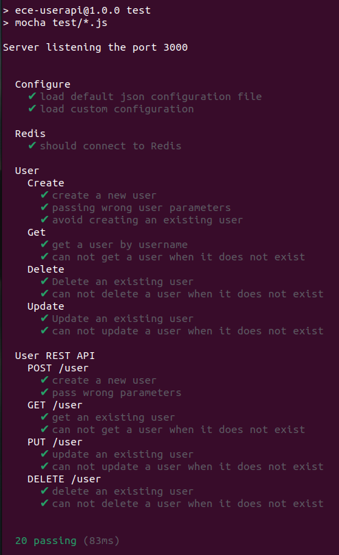

# Instructions

## Installation

This application is written on NodeJS and it uses Redis database.

1. [Install NodeJS](https://nodejs.org/en/download/)

2. [Install Redis](https://redis.io/download)

3. Install application

Go to the root directory of the application (where `package.json` file located) and run:

```
npm install 
```

## Usage

1. Start a web server

From the root directory of the project run:

```
npm start
```

It will start a web server available in your browser at http://localhost:3000.

2. Create a user

Send a POST (REST protocol) request using terminal:

```bash
curl --header "Content-Type: application/json" \
  --request POST \
  --data '{"username":"koleoptere","firstname":"robin","lastname":"vandessel"}' \
  http://localhost:3000/user
```

It will output:

```
{"status":"success","msg":"OK"}
```

Another way to test your REST API is to use [Postman](https://www.postman.com/).


## Testing

From the root directory of the project, run:

```
npm test
```


# Project Report

First semester project of DevOps.

## 1. Create a web application
The web application was developed using **NodeJS** and configured to run on port 3000. **Redis** was used as the database, and the routes and controllers folders were used to make changes to the database, such as creating a user. The application was covered with 20 tests to ensure its proper functioning, including tests for configuration, the Redis connection, and the user CRUD methods as well as the REST API. This testing strategy helps to ensure that the different components of the application are working correctly and that the API is able to handle expected requests and responses.
- The little user API application with CRUD:

Create:
 


Read:


Update:


Delete:


- The storage in Redis database:


- All tests: unit, API, configuration, connection & the health check endpoint ensuring an application is functional:



- - - -

## 2. Apply CI/CD pipeline

For applying CI/CD, we use a configuration file named [main.yaml](./github/workflows/main.yaml)

### Continuous Integration
First, we applied continuous integration using GitHub Actions:


### Continuous Deployments
Second, we applied continuous deployments using Heroku:


- - - -

## 3. Configure and provision a virtual environment and run your application using the IaC approach

To create a VM with Vagrant, we created a [Vagrantfile](./iac/Vagrantfile) inside the iac folder. 
We copied the project file into the VM using `config.vm.provision "file", source: "..", destination: "$HOME/devopsproject"` 

* To print a current date into the `/etc/vagrant_provisioned_at` file we replace in the `Vagrantfile` with this:

```ruby
# Start provisioning
$script = <<-SCRIPT
echo I am provisioning...
date > /etc/vagrant_provisioned_at
SCRIPT

config.vm.provision "shell", inline: $script
```

Then, we run:

```bash
vagrant provision
```

We enter to the VM and read the `/etc/vagrant_provisioned_at` file content:

```bash
vagrant ssh
# ... entering to VM
cat /etc/vagrant_provisioned_at
```
We show the result below:


* redis is correctly installed and connected:


* nodejs is correctly installed and application is running:


* Our application can be started in the VM:


* To be able to use sync_folder we were needed to install the vbguest-plugin by typing theses commands:
```bash
vagrant plugin install vagrant-vbguest
vagrant vbguest
```

* healthcheck is correctly installed :


- - - -
## 4. Build Docker image of your application

We create a Docker image by adding a [Docker file](./Dockerfile) and running:
```bash
docker build -t rovandessel/devopsproject .
```


We run:
```bash
docker push rovandessel/devopsproject
```


## 5. Make container orchestration using Docker Compose

We create a [docker-compose](./docker-compose.yml) and we run:
```bash
docker-compose up
```
If you want the docker-compose to work, you need to do it twice, for the moment this is the only way we were capable of obtain a good result.
We obtain this:


We can test that the application is currently running by entering the container and typing:
```bash
curl "localhost:3000"
```
The result is the following:


We can also test if redis is working well with the command:
```bash
docker exec devopsproject_redis_1  sh -c "redis-cli ping"
```
We obtain this:


- - - -
## 6. Make docker orchestration using Kubernetes

First, we install minikube with the command:
```bash
minikube start
```
After we create some pods, services and deployments:
```bash
kubectl apply -f pv.yaml
kubectl apply -f redis-deployment.yaml
kubectl apply -f redis-pvc.yaml
kubectl apply -f redis-service.yaml
kubectl apply -f web-deployment.yaml
kubectl apply -f web-service.yaml
```
We check if they successfully run:


We can start the web service:

- - - -
## 7. Make a service mesh using Istio

To begin, we download Istio with the command:
```bash
curl -L https://istio.io/downloadIstio | sh -
```
After, we move to the Istio package directory, and we add the istioctl client to our path:
```bash
cd istio-1.16.1
export PATH=$PWD/bin:$PATH
```
We need to start minikube:
```bash
minikube config set driver kvm2
minikube start --memory=4000mb --cpus=4 --kubernetes-version=v1.20.2
```


In another terminal we type:
```bash
minikube tunnel --cleanup
```


We install istio with the demo configuration file:
```bash
istioctl install --set profile=demo -y
```


We add a namespace label to instruct Istio to automatically inject Envoy sidecar proxies when we deploy our application later:
```bash
kubectl label namespace default istio-injction=enabled
```
We go to the k8s folder and deploy our application:
```bash
cd k8s
kubectl apply -f .
```


We set the ingress host and ports:
```bash
export INGRESS_HOST=$(kubectl -n istio-system get service istio-ingressgateway -o jsonpath='{.status.loadBalancer.ingress[0].ip}')
export INGRESS_PORT=$(kubectl -n istio-system get service istio-ingressgateway -o jsonpath='{.spec.ports[?(@.name=="http2")].port}')
export SECURE_INGRESS_PORT=$(kubectl -n istio-system get service istio-ingressgateway -o jsonpath='{.spec.ports[?(@.name=="https")].port}')
```

We set GATEWAY_URL:
```bash
export GATEWAY_URL=$INGRESS_HOST:$INGRESS_PORT
```

We can start now the application:
```bash
minikube service web
```


- - - -
## 8. Implement Monitoring to your containerized application

# Links

- [Node.js](https://nodejs.org/en/)
- [Github Action](https://github.com/features/actions)
- [Heroku](heroku.com)
- [Istio](https://istio.io/)
  - [Kiali](https://kiali.io/)
  - [Prometheus](https://istio.io/latest/docs/ops/integrations/prometheus/)
- [Docker](https://www.docker.com/)
- [Vagrant](https://www.vagrantup.com/)
  - [Ansible](https://www.ansible.com/)
- [Kubernetes](https://kubernetes.io/)
- [Postman](https://www.postman.com/)
- [Docker Hub](https://hub.docker.com/)


# Authors

[Benjamin DAVID](https://github.com/benji920)
[Robin VAN DESSEL](https://github.com/vdRobin)
